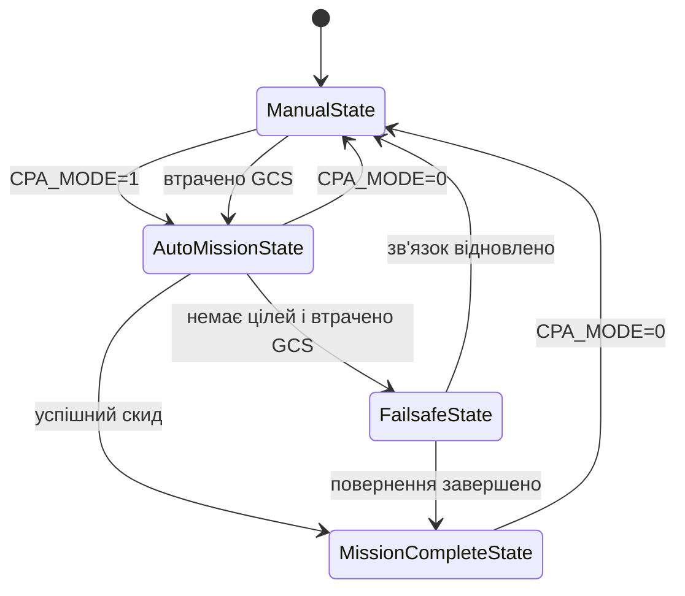

# Курсовий проєкт: MAVLink-автопілот із режимами MANUAL/AUTO та FAILSAFE-поведінкою

## Загальна інформація

Мета проєкту - реалізувати автопілот дрона, який отримує телеметрію та дані про цілі через UART, виконує автоматичну місію, передає стан у QGroundControl через MAVLink і реагує на втрату каналу керування або актуальних даних про цілі.

Основна перевірка виконується в Ubuntu ARM64 VM за допомогою симуляційного checker, socat і QGroundControl на host-машині.

Студент: Artem Yanko  
Student ID: `1035`

## Документація дизайну та інтеграції

Детальний опис архітектури, зовнішніх API, обґрунтування технічних рішень, системних вимог і підключення модуля до готової Linux-системи наведено в документі [«Дизайн та інтеграція автопілота»](docs/design_and_integration.md).

## Реалізовані можливості

- запуск завжди починається в ручному режимі `MANUAL`;
- перемикання `MANUAL`/`AUTO` з QGroundControl через MAVLink-параметр `CPA_MODE`;
- отримання телеметрії, конфігурації дрона, боєприпасу та координат цілей через UART;
- вибір цілі, прогноз її руху та обчислення точки скидання;
- автоматичне керування прискоренням і поворотом дрона;
- скид через GPIO або симуляційний GPIO bank;
- передавання MAVLink-телеметрії та текстових статусів у QGroundControl;
- виявлення втрати heartbeat від наземної станції;
- автоматичний перехід із `MANUAL` до `AUTO` після втрати каналу керування;
- визначення неактуальних цілей і очікування нових даних;
- failsafe-повернення до останньої позиції, де був зв'язок;
- запис результату симуляції у `simulation.json`;
- сценарні скрипти для повторюваної демонстрації поведінки.

## Режими та стани автопілота

Оператору доступні два режими:

- `MANUAL` (`CPA_MODE=0`) - автопілот не виконує місію та не втручається в керування;
- `AUTO` (`CPA_MODE=1`) - активується автоматичне виконання місії.

Внутрішня state machine використовує такі стани:

- `ManualState` - ручний режим очікування дій оператора;
- `AutoMissionState` - вибір цілі, навігація і виконання скиду боєприпасу;
- `FailsafeState` - повернення до останньої точки стабільного зв'язку;
- `MissionCompleteState` - місію або failsafe-повернення завершено.



Для фізичного руху використовується окрема state machine з минулих завдань курсу:

```
Stopped → Turning → Accelerating → Moving → Decelerating
```

Одна й та сама реалізація `WaypointNavigator` використовується для польоту до точки скидання та для failsafe-повернення.

## Логіка втрати даних і failsafe

Ціль вважається неактуальною, якщо інформація про неї не оновлювалася протягом 10 секунд. Якщо активних цілей немає, починається 30-секундне очікування нових даних.

Після завершення цього таймауту failsafe-повернення запускається лише тоді, коли:

1. автопілот перебуває в автоматичному режимі;
2. QGroundControl раніше був підключений;
3. на момент завершення очікування зв'язок із QGroundControl відсутній.

Точкою повернення є остання позиція, на якій був отриманий heartbeat GCS. Початкова UART-телеметрія зберігається як резервна домашня позиція.

Під час повернення дрон:

1. гальмує перед розворотом, якщо має значну швидкість;
2. повертається до контрольної точки;
3. розраховує гальмівний шлях;
4. зупиняється;
5. переходить у `MissionCompleteState`.

Якщо зв'язок відновлюється під час повернення, failsafe скасовується і керування переходить у `MANUAL`.

## MAVLink і QGroundControl

Застосунок надсилає в QGroundControl:

- `HEARTBEAT`;
- `GLOBAL_POSITION_INT`;
- `ATTITUDE`;
- `STATUSTEXT` зі змінами стану та подіями;
- команду скидання з повторними спробами до отримання ACK.

Параметр `CPA_MODE` передається як `MAV_PARAM_TYPE_UINT8`:

```
0 - MANUAL
1 - AUTO
```

Для сумісності з QGroundControl значення `UINT8` кодується побайтово всередині поля MAVLink `param_value`.

## Структура проєкту

| Каталог | Відповідальність |
|---|---|
| `include/autopilot`, `src/autopilot` | Режими, високорівнева state machine, target wait і failsafe return |
| `include/core`, `src/core` | Виконання місії, аналіз цілей і навігація до waypoint |
| `include/states`, `src/states` | Низькорівневі стани руху дрона |
| `include/io`, `src/io` | UART, UDP і GPIO адаптери |
| `include/mavlink`, `src/mavlink` | Обмін MAVLink із QGroundControl |
| `include/providers`, `src/providers` | Конфігурація і балістичні розрахунки |
| `include/simulation`, `src/simulation` | Запис історії симуляції |
| `include/publishing`, `src/publishing` | Публікація результату |
| `scripts` | Підготовка VM, автоматичні тести та демонстраційні сценарії |

## Залежності

MAVLink-бібліотеку потрібно розмістити в корені репозиторію:

```
git clone https://github.com/mavlink/c_library_v2.git c_library_v2
```

Підготовка Ubuntu VM:

```
sudo ./course_project_autopilot/scripts/init_vm.sh
```

## Збірка

Команди виконуються з кореня репозиторію:

```
cmake --preset debug
cmake --build --preset debug --target course_project_autopilot_app
```

Виконуваний файл:

```
build/debug/course_project_autopilot/course_project_autopilot_app
```

## Мережа QGroundControl

У тестовому середовищі використовувався VirtualBox Host-only Network:

```
host / QGroundControl: 192.168.56.1
Ubuntu VM:              192.168.56.2
MAVLink UDP port:       14550
```

IP і порт можна змінити через `MAVLINK_HOST` та `MAVLINK_PORT` під час запуску сценаріїв.

## Запуск автоматичних тестів

Один тест:

```
./course_project_autopilot/scripts/run_sim_tests.sh T01
```

Усі десять тестів:

```
./course_project_autopilot/scripts/run_sim_tests.sh
```

Корисні параметри середовища:

```
DEBUG_AUTO=true
MAVLINK=true
MAVLINK_HOST=192.168.56.1
MAVLINK_PORT=14550
PUBLISH=false
DEBUG_TARGET_LOSS_AFTER=1
DEBUG_TARGET_LOSS_DURATION=15
```

Перед кожним тестом runner очищує `/tmp/cpa-sim-bank` і самостійно запускає `socat`, checker та застосунок.

## Демо сценарії

Скрипт `run_demo.sh` виводить інструкції для оператора і зберігає повний лог у локальний каталог `course_project_autopilot/demo_logs/`.

### 1. Звичайна автоматична місія

```
./course_project_autopilot/scripts/run_demo.sh normal-auto T01
```

Після підключення потрібно встановити `CPA_MODE=1` у QGroundControl.

Очікуваний перехід:

```
ManualState → AutoMissionState → MissionCompleteState
```

### 2. Втрата каналу керування в MANUAL

```
./course_project_autopilot/scripts/run_demo.sh control-loss T01
```

Потрібно залишити `CPA_MODE=0`, дочекатися підключення та закрити QGroundControl.

Очікуваний перехід:

```
ManualState → AutoMissionState → MissionCompleteState
```

### 3. Failsafe-повернення

```
./course_project_autopilot/scripts/run_demo.sh failsafe-return T01
```

Після підключення потрібно закрити QGroundControl. Скрипт припиняє надходження нових даних про цілі, після чого автопілот повертається до останньої точки зв'язку.

Очікуваний перехід:

```
AutoMissionState → FailsafeState → MissionCompleteState
```

### 4. Відновлення зв'язку під час повернення

```
./course_project_autopilot/scripts/run_demo.sh failsafe-recovery T01
```

QGroundControl потрібно знову відкрити після початку failsafe-повернення.

Очікуваний перехід:

```
FailsafeState → ManualState
```

## Результати перевірки

### Звичайна автоматична місія

`normal-auto`, T01 -  Перемикання з QGC, автоматичний політ, ураження цілі №2 з промахом `0.35 м`, штатне завершення

Застосунок запустився у `MANUAL`. Після встановлення `CPA_MODE=1` у QGroundControl активувався `AutoMissionState`, була обрана ціль №2 та виконано скид. Checker підтвердив влучання з промахом `0.35 м`, після чого автопілот перейшов у `MissionCompleteState`.

```text
[LOG] MAVLink GCS connected: synchronized CPA_MODE=0
[LOG] MAVLink PARAM_SET CPA_MODE=AUTO
[LOG] Autopilot mode changed: MANUAL -> AUTO, state=ManualState -> AutoMissionState
[LOG] TARGET lock acquired: target=2
[checker] REZULTAT: HIT tsil=2 promah=0.35 m (hitR=3.0)
[LOG] DROP triggered
[LOG] Autopilot state changed: AutoMissionState -> MissionCompleteState
[LOG] AUTO mission completed
Summary:
  T01: ok
```

### Автоматичне перехоплення керування

`control-loss`, T01 - Автоматичне перехоплення керування після втрати QGC, ураження цілі №2 з промахом `0.28 м`

QGroundControl спочатку був підключений, а автопілот залишався в `MANUAL`. Після припинення heartbeat зв'язок було оголошено втраченим, і автопілот самостійно активував `AUTO`. Місія завершилася влучанням у ціль №2 з промахом `0.28 м`.

```text
[LOG] MAVLink GCS connected: synchronized CPA_MODE=0
[LOG] MAVLink GCS link lost
[LOG] CONTROL LINK LOST at position=(150, 150)
[LOG] Autopilot mode changed: MANUAL -> AUTO, state=ManualState -> AutoMissionState
[LOG] CONTROL LINK LOST: MANUAL -> AUTO takeover
[LOG] TARGET lock acquired: target=2
[checker] REZULTAT: HIT tsil=2 promah=0.28 m (hitR=3.0)
[LOG] DROP triggered
[LOG] Autopilot state changed: AutoMissionState -> MissionCompleteState
[LOG] AUTO mission completed
Summary:
  T01: ok
```

### Failsafe-повернення

`failsafe-return`, T01 - Втрата цілей і GCS, очікування 30 секунд, повернення та зупинка за `2.51 м` від контрольної точки

Після контрольованого припинення пакетів цілей і закриття QGroundControl автопілот дочекався завершення target wait timeout. Дрон загальмував, розвернувся та повернувся до останньої позиції зв'язку `(175.816, 179.864)`.

На початку гальмування відстань становила `354.00 м` і тимчасово зросла до `363.50 м` через інерцію. Після повернення дрон зупинився в межах дозволеного радіуса - за `2.51 м` від контрольної точки - та перейшов у `MissionCompleteState`.

```text
[LOG] DEBUG TARGET LOSS started at t_ms=1099
[LOG] MAVLink GCS link lost
[LOG] CONTROL LINK LOST at position=(175.816, 179.864)
[LOG] TARGET WAIT started: no active targets
[LOG] TARGET WAIT timeout after 30 seconds
[LOG] Autopilot state changed: AutoMissionState -> FailsafeState
[LOG] FAILSAFE RETURN started: destination=last link position (175.816, 179.864)
[LOG] FAILSAFE RETURN distance=353.998, navigationState=Decelerating, accel=-1, turnRate=0
[LOG] FAILSAFE RETURN distance=363.498, navigationState=Turning, accel=0, turnRate=1
[LOG] FAILSAFE RETURN distance=2.50694, navigationState=Decelerating, accel=-1, turnRate=0
[LOG] Autopilot state changed: FailsafeState -> MissionCompleteState
[LOG] FAILSAFE RETURN completed
```

### Відновлення зв'язку під час повернення

`failsafe-recovery`, T01 - Відновлення GCS під час повернення, скасування failsafe і перехід у `MANUAL`

Було повторено втрату цілей і GCS до переходу у `FailsafeState`. Під час зворотного польоту QGroundControl запущено повторно. Heartbeat був відновлений, failsafe-повернення скасовано, а автопілот передав керування оператору в режимі `MANUAL`.

```
[LOG] Autopilot state changed: AutoMissionState -> FailsafeState
[LOG] MAVLink GCS link restored: synchronized CPA_MODE=1
[LOG] Autopilot mode changed: AUTO -> MANUAL, state=FailsafeState -> ManualState
[LOG] CONTROL LINK RESTORED: FAILSAFE_RETURN -> MANUAL
```

Сценарії `failsafe-return` і `failsafe-recovery` завершувалися оператором через `Ctrl+C` після підтвердження очікуваного переходу. Тому для них відсутній підсумок `T01: ok`, який runner друкує лише після штатного завершення процесу.

Результат кожної симуляції записується у:

```
course_project_autopilot/results/<TEST_ID>/simulation.json
```

## Обмеження

- `MANUAL` є пасивним режимом: приймання команд реального RC-пульта не входить до поточного обсягу проєкту;
- після переходу в `MANUAL` дрон зберігає поточну швидкість, доки оператор не надасть нову команду;
- QGroundControl використовується для параметра режиму, телеметрії та статусів, але MAVLink Mission Protocol не реалізований;
- втрата даних про цілі відтворюється контрольованою debug-ін'єкцією, оскільки вихідний код checker недоступний;
- hardware-режим передбачений конфігурацією, але наведені результати отримані в Ubuntu ARM64 VM.
