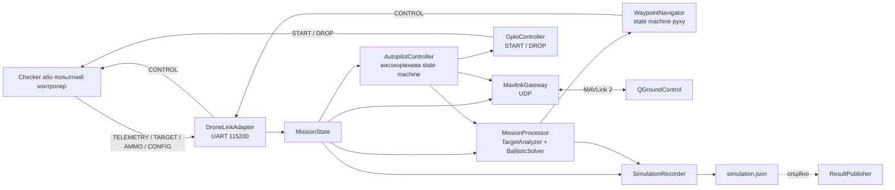
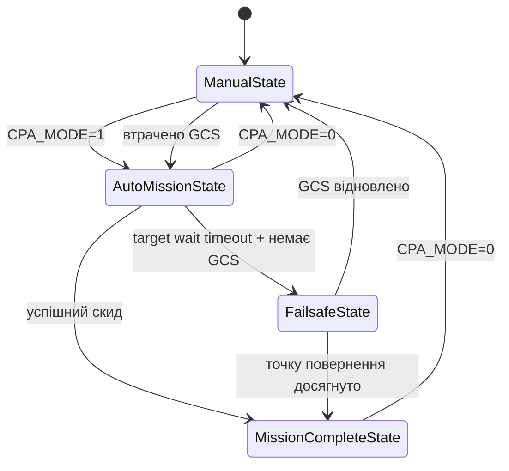

# Дизайн та інтеграція автопілота

## Призначення документа

Цей документ описує дизайн, зовнішні API, обґрунтування архітектурних рішень, системні вимоги та порядок інтеграції модуля `course_project_autopilot` у симуляційне або апаратне оточення.

Основний [README](../README.md) містить інструкції зі збірки, демонстраційні сценарії та результати їх перевірки. Тут основна увага приділена внутрішній будові системи та контрактам між її компонентами.

## Практична користь

Модуль розв'язує задачу автономного виконання польотного завдання за умов нестабільного каналу керування:

- оператор може активувати або скасувати автоматичну місію через стандартний MAVLink-сумісний інтерфейс;
- у разі втрати наземної станції під час ручного режиму автопілот може продовжити завдання автономно;
- короткочасна втрата даних про окрему ціль не викликає негайної аварійної реакції;
- коли актуальних цілей тривалий час немає і зв'язок із GCS не відновлюється, дрон повертається до останньої відомої точки зв'язку;
- логіка може перевірятися без фізичного дрона за допомогою checker і файлового GPIO bank;
- телеметрія та стани доступні оператору у QGroundControl;
- історія симуляції зберігається у JSON для подальшого аналізу або візуалізації.

Це дозволяє використовувати однакову місійну логіку в навчальному симуляторі та в Linux-системі з реальними UART/GPIO пристроями. Для переходу на інше обладнання достатньо замінити адаптери вводу-виводу, не переписуючи алгоритми вибору цілі, навігації та failsafe.

## Межі відповідальності

Модуль відповідає за:

- приймання стану дрона, параметрів місії та цілей;
- вибір цілі й формування нормованих команд руху;
- визначення моменту скидання;
- режими `MANUAL`/`AUTO` та failsafe-поведінку;
- передавання телеметрії та статусів у QGroundControl;
- запис результатів симуляції.

За межами поточної реалізації залишаються:

- стабілізація двигунів і робота польотного контролера;
- приймання каналів реального RC-пульта;
- планування маршрутів MAVLink Mission Protocol;
- драйвер конкретного механізму скидання;
- визначення цілей сенсорами або зовнішньою системою спостереження.

## Загальна архітектура



### Основні компоненти

| Компонент | Відповідальність |
|---|---|
| `DroneLinkAdapter` | Неблокуюче читання UART, декодування пакетів і надсилання `PKT_CONTROL` |
| `MissionState` | Поточний знімок телеметрії, конфігурації, боєприпасу та tracks цілей |
| `AutopilotController` | Режим оператора та переходи між станами місії |
| `MissionProcessor` | Вибір цілі, прогноз руху, балістика, точка скидання та команда навігації |
| `TargetAnalyzer` | Аналіз доступних цілей та вибір найкращої |
| `IBallisticSolver` | Абстракція способу балістичного розрахунку |
| `WaypointNavigator` | Формування команд руху до заданої локальної координати |
| `IDroneState` | Контракт низькорівневих станів руху |
| `TargetWaitMonitor` | Очікування появи актуальних цілей і формування timeout-події |
| `ReturnController` | Повернення до контрольної точки з гальмуванням і зупинкою |
| `GpioController` | START і DROP у SIM або HW режимі |
| `MavlinkGateway` | Телеметрія QGC, heartbeat, параметр режиму, команди та ACK |
| `SimulationRecorder` | Накопичення кроків і запис `simulation.json` |
| `ResultPublisher` | Опційна HTTP-публікація записаної симуляції |

## State machine автопілота

Високорівнева state machine визначає, хто керує дроном і яка поведінка зараз дозволена.



| Стан | Місійна навігація | Скид | Повернення |
|---|---:|---:|---:|
| `ManualState` | ні | ні | ні |
| `AutoMissionState` | так | так | ні |
| `FailsafeState` | ні | ні | так |
| `MissionCompleteState` | ні | ні | ні |

Режим оператора має лише два значення: `MANUAL` і `AUTO`. `FailsafeState` та `MissionCompleteState` є внутрішніми станами, а не окремими значеннями `CPA_MODE`.

## State machine фізичного руху

Низькорівнева state machine перетворює цільову координату на нормовані команди `accel` і `turnRate`:

```text
Stopped → Turning → Accelerating → Moving → Decelerating
```

Вхід — телеметрія, цільовий waypoint і фізичні обмеження дрона. Такий розподіл дозволяє `MissionProcessor` і `ReturnController` використовувати один `WaypointNavigator`.

Під час failsafe-повернення навігатор:

- оцінює гальмівний шлях за поточною швидкістю;
- починає гальмування до досягнення waypoint;
- вважає дрон зупиненим за швидкості до `0.001 м/с`;
- завершує повернення в радіусі 3 метрів.

## Обґрунтування архітектурних рішень

### Дві незалежні state machine

Режими автопілота і фізичні фази руху змінюються з різних причин. Наприклад, `AutoMissionState` може послідовно містити поворот, розгін і рівномірний рух. Об'єднання цих понять в один enum створило б велику кількість комбінованих станів. Дві state machine зберігають кожну відповідальність локальною.

### Адаптери

UART, GPIO і UDP залежать від Linux API та конкретного обладнання. `DroneLinkAdapter`, `GpioController` і `UdpSocket` ізолюють ці залежності від місійної логіки. У симуляції GPIO представлено файлами, а в HW-режимі використовується `libgpiod`, але `AutopilotController` і `MissionProcessor` не змінюються.

### UART як основне джерело даних

Початкова позиція, висота, напрямок, фізичні обмеження та параметри боєприпасу надходять від checker або польотного контролера. Тому різні місії можуть мати різні початкові умови без перекомпіляції застосунку. JSON-файли використовуються як fallback для конфігурації, коли відповідний runtime-пакет ще не отримано.

### Абстракція балістичного solver

`IBallisticSolver` дозволяє використовувати табличний або аналітичний розрахунок через один контракт. 

### Повторне використання `WaypointNavigator`

Автоматична місія та failsafe-повернення потребують однакових команд повороту, розгону й руху. Окремий `ReturnController` задає destination і правило зупинки, а не дублює фізичну логіку польоту.

### Пасивний `MANUAL`

У `MANUAL` автопілот продовжує читати телеметрію та публікувати її в QGC, але не формує місійну траєкторію. Це залишає керування зовнішньому операторському каналу.

### Контроль актуальності цілей

Одразу реагувати на один пропущений пакет небезпечно через можливі затримки UART або зовнішні перешкоди. Тому track цілі залишається активним 10 секунд після останнього оновлення. Коли всі tracks неактивні, `TargetWaitMonitor` ще 30 секунд очікує нові дані.

### Умовне failsafe-повернення

Втрата QGC в `AUTO` не зупиняє актуальну місію: автономність є очікуваною поведінкою. Повернення запускається лише за одночасної відсутності актуальних цілей і каналу GCS. Це відрізняє тимчасову проблему зв'язку від ситуації, коли продовжувати завдання вже неможливо.

### Остання позиція зв'язку як destination

Повернення до останньої позиції heartbeat підвищує ймовірність повторного встановлення зв'язку. Початкова позиція з першої UART-телеметрії зберігається як fallback, якщо позиція останнього зв'язку недоступна.

### Запис перед публікацією

Симуляція спочатку записується в тимчасовий файл і переназивається, а вже потім може бути опублікована. Навіть за недоступності HTTP-сервера локальний результат не втрачається.

## Зовнішні API та контракти

Стабільними інтеграційними межами є UART-протокол, GPIO, MAVLink/UDP, CLI та JSON.

## UART API

### Налаштування порту

| Параметр | Значення |
|---|---|
| Режим | raw, неблокуючий |
| Швидкість | `115200` baud |
| Пристрій SIM за замовчуванням | `/tmp/ttyA` |
| Пристрій HW за замовчуванням | `/dev/ttyAMA1` |
| Порядок байтів payload | little-endian |

### Типи пакетів

| TYPE | Напрямок | Payload | Призначення |
|---|---|---|---|
| `0x01 PKT_TELEMETRY` | контролер → застосунок | `Telemetry`, 33 bytes | Час, позиція, швидкість, курс і стан фізичної моделі |
| `0x02 PKT_TARGET` | контролер → застосунок | `TargetPos`, 9 bytes | ID та поточна локальна позиція однієї цілі |
| `0x03 PKT_AMMO` | контролер → застосунок | `AmmoCfg`, 33 bytes | Назва, фізичні параметри, hit radius і кількість цілей |
| `0x04 PKT_RESULT` | контролер → застосунок | `Result`, 10 bytes | Формат результату визначено протоколом; поточний adapter його не обробляє |
| `0x05 PKT_CONTROL` | застосунок → контролер | `Control`, 8 bytes | Нормовані команди прискорення і повороту |
| `0x06 PKT_CONFIG` | контролер → застосунок | `DroneCfg`, 24 bytes | Фізичні обмеження та часові параметри |

Структури мають packing `1 byte`. Інтегратор має використовувати точні типи й порядок полів із `include/utils/drone_link.hpp`.

### Одиниці та діапазони

| Поле | Одиниця або діапазон |
|---|---|
| `Telemetry.t_ms` | мілісекунди від старту |
| `x`, `y`, `z` | метри |
| `vx`, `vy`, `speed` | м/с |
| `dir` | радіани; математичний кут, `0` спрямований на схід |
| `Control.accel` | `[-1; 1]`, де `-1` — гальмування, `1` — повне прискорення |
| `Control.turnRate` | `[-1; 1]`, де `1` — максимальний поворот ліворуч |
| `DroneCfg.angularSpeed` | рад/с |
| `DroneCfg.timeStep` | секунди |

Під час активної місії або повернення `PKT_CONTROL` формується не частіше одного разу на 20 мс. У `MANUAL` застосунок не створює безперервний потік команд керування.

## GPIO API

| Сигнал | SIM default | HW default | Поведінка |
|---|---:|---:|---|
| `START` | line 24 | line 27 | Встановлюється у HIGH після успішної ініціалізації |
| `DROP` | line 23 | line 22 | HIGH протягом 300 мс, потім LOW |

У SIM-режимі кожна лінія представлена файлом:

```text
<sim-bank>/sim_gpio<line>/value
```

Типовий bank: `/tmp/cpa-sim-bank`. Checker читає ці файли як заглушку GPIO.

У HW-режимі використовується `libgpiod` і chip `gpiochip0`. Номери chip та line можна перевизначити CLI-аргументами. Процес повинен мати права читання/запису відповідного `/dev/gpiochip*`.

## MAVLink/UDP API

### Транспорт та ідентифікація

| Параметр | Значення |
|---|---|
| Транспорт | connected UDP socket |
| Default host | `127.0.0.1` для app; demo runner використовує `192.168.56.1` |
| Default port | `14550` |
| MAVLink system ID | `1` |
| MAVLink component ID | `MAV_COMP_ID_AUTOPILOT1` |
| Vehicle type | `MAV_TYPE_QUADROTOR` |
| Autopilot type | `MAV_AUTOPILOT_GENERIC` |

### Вихідні повідомлення

| Повідомлення | Частота/умова | Дані |
|---|---|---|
| `HEARTBEAT` | приблизно 1 Гц | `MANUAL` або `AUTO`, стан системи active |
| `GLOBAL_POSITION_INT` | приблизно 5 Гц | Позиція, висота, швидкість і heading |
| `ATTITUDE` | приблизно 5 Гц | Yaw, перетворений у MAVLink compass convention |
| `PARAM_VALUE` | підключення або запит параметра | Значення `CPA_MODE` |
| `STATUSTEXT` | зміна режиму, скид, завершення | Людинозрозумілий стан для QGC |
| `COMMAND_LONG` | після скидання | `MAV_CMD_USER_1` з координатами та висотою |
| `COMMAND_ACK` | відповідь на підтриману команду режиму | Результат виконання |

Команда скидання повторюється кожні 500 мс до ACK, максимум п'ять спроб. Координати передаються через `param5`, `param6`, висота — через `param7`.

### Вхідні повідомлення

- GCS `HEARTBEAT` — визначення першого підключення, втрати та відновлення зв'язку;
- `PARAM_REQUEST_LIST` і `PARAM_REQUEST_READ` — читання `CPA_MODE`;
- `PARAM_SET` — зміна `CPA_MODE`;
- `SET_MODE` або `MAV_CMD_DO_SET_MODE` — альтернативне перемикання режиму;
- `COMMAND_ACK` для `MAV_CMD_USER_1` — підтвердження команди скидання.

Зв'язок вважається втраченим, якщо heartbeat GCS не надходить протягом 3 секунд.

### Параметр `CPA_MODE`

| Значення | Режим |
|---:|---|
| `0` | `MANUAL` |
| `1` | `AUTO` |

Тип параметра — `MAV_PARAM_TYPE_UINT8`. QGroundControl передає цілочисельне значення побайтово всередині float-поля `param_value`, тому gateway використовує bytewise encode/decode, а не числове перетворення `float`.

### Система координат для QGroundControl

Внутрішня симуляція використовує локальні `x/y` у метрах. Для відображення на карті вони перетворюються у географічні координати відносно anchor:

```text
latitude:  50.4501
longitude: 30.5234
```

## CLI API

| Аргумент | Призначення |
|---|---|
| `--sim` | SIM defaults: `/tmp/ttyA`, `/tmp/cpa-sim-bank`, START 24, DROP 23 |
| `--hw` | HW defaults: `/dev/ttyAMA1`, `gpiochip0`, START 27, DROP 22 |
| `--uart <path>` | Перевизначити UART device |
| `--gpiochip <name>` | Перевизначити GPIO chip |
| `--sim-bank <path>` | Каталог файлового GPIO bank |
| `--start-line <n>` | Номер START line |
| `--drop-line <n>` | Номер DROP line |
| `--config <path>` | Fallback JSON конфігурація дрона |
| `--ammo <path>` | Fallback JSON параметри боєприпасів |
| `--ballistic-table <path>` | Таблиця для `TableSolver` |
| `--mavlink [true]` | Увімкнути MAVLink gateway |
| `--mavlink-host <host>` | Адреса QGC |
| `--mavlink-port <port>` | UDP порт QGC |
| `--test-id <id>` | ID тесту для output і публікації |
| `--output-dir <path>` | Кореневий каталог результатів |
| `--student-id <id>` | Student ID для публікації |
| `--publish true` | Опублікувати успішну симуляцію |
| `--stop-after-drop true` | Завершити процес після скидання |
| `--debug-auto` | Запустити AUTO без команди QGC; лише для тестування |
| `--debug-target-loss-after <sec>` | Почати ігнорувати `PKT_TARGET` через заданий час |
| `--debug-target-loss-duration <sec>` | Відновити приймання цілей через заданий час; якщо параметр не задано, втрата триває до завершення |

Boolean-параметри приймають текстове значення `true`; інші значення трактуються як `false`.

## JSON API результату

Файл створюється за шляхом:

```text
<output-dir>/<test-id>/simulation.json
```

Запис виконується атомарно: спочатку створюється `.tmp`, після успішного запису він перейменовується в `simulation.json`.

Схема верхнього рівня:

```json
{
  "totalSteps": 0,
  "steps": [
    {
      "position": { "x": 150.0, "y": 150.0 },
      "direction": 0.0,
      "state": 0,
      "targetIndex": 2,
      "dropPoint": { "x": 212.8, "y": 221.6 },
      "aimPoint": { "x": 235.1, "y": 247.0 },
      "predictedTarget": { "x": 235.5, "y": 249.1 },
      "timeSecSinceStart": 1.1
    }
  ]
}
```

| Поле | Значення |
|---|---|
| `totalSteps` | Індекс останнього записаного кроку; `0`, якщо список порожній |
| `position` | Локальна позиція дрона в метрах |
| `direction` | Курс симулятора в радіанах |
| `state` | Числовий стан фізичної моделі від checker |
| `targetIndex` | ID обраної цілі або `-1` |
| `dropPoint` | Розрахована точка початку скидання |
| `aimPoint` | Прогнозована точка падіння |
| `predictedTarget` | Прогнозована позиція цілі на момент падіння |
| `timeSecSinceStart` | Час симуляції в секундах |

За прапорця `--publish true` JSON обгортається полями `studentId`, `testId`, `simulation` і надсилається HTTP POST. Публікація має обмежений timeout, повторює тимчасові помилки та перевіряє результат окремим GET-запитом. Поточний endpoint є частиною навчальної інфраструктури

Поточний контракт навчального сервера:

```text
POST http://cppmiltech.com.ua/api/dz12/results
GET  http://cppmiltech.com.ua/api/dz12/results/<testId>/<studentId>
```

Публікацію можна перевірити через test runner:

```bash
PUBLISH=true DEBUG_AUTO=true \
  ./course_project_autopilot/scripts/run_sim_tests.sh T01
```

Успішний результат підтверджується логом:

```text
Publish report: T01 -> published attempts=1
```

## Системні вимоги

### Перевірене середовище

- Ubuntu ARM64 VM;
- CMake 3.20+;
- Ninja;
- GCC із підтримкою C++20;
- `libgpiod`/`libgpiod-dev`;
- `socat`;
- MAVLink `c_library_v2` у корені репозиторію;
- QGroundControl на host-машині;
- VirtualBox Host-only Network між host і VM.

Фактичні результати курсової отримані з ARM64 checker у VM.

### Права доступу

- SIM-режиму потрібен запис у `/tmp` або інший каталог `--sim-bank`;
- HW-режиму потрібен доступ до UART device і `/dev/gpiochip*`;
- якщо користувач не входить до відповідних системних груп, застосунок потрібно запускати через `sudo` або налаштувати udev/group permissions;
- для QGroundControl має бути доступний вихідний UDP-трафік до заданих host і port;
- для `--publish true` потрібні DNS і TCP-доступ до сервера публікації.

## Інтеграція в готову Linux-систему

### 1. Підготувати залежності

```bash
sudo ./course_project_autopilot/scripts/init_vm.sh
git clone https://github.com/mavlink/c_library_v2.git c_library_v2
```

### 2. Зібрати застосунок

```bash
cmake --preset debug
cmake --build --preset debug --target course_project_autopilot_app
```

### 3. Підключити джерело UART

Зовнішня система повинна:

1. відкрити сумісний serial channel на `115200`;
2. після START надсилати `PKT_TELEMETRY`, `PKT_AMMO`, `PKT_CONFIG` і періодичні `PKT_TARGET`;
3. приймати `PKT_CONTROL`;

### 4. Підключити START/DROP

У симуляції checker і застосунок повинні використовувати однаковий `--sim-bank`, `--start-line` та `--drop-line`. На hardware потрібно перевірити нумерацію GPIO chip/offset, рівні сигналів і сумісність 300-мс імпульсу DROP з виконавчим механізмом.

### 5. Налаштувати QGroundControl

1. забезпечити IP-зв'язок між Linux-пристроєм і host із QGC;
2. відкрити UDP listener на порту `14550`;
3. запустити застосунок із `--mavlink true --mavlink-host <QGC-IP> --mavlink-port 14550`;
4. дочекатися появи vehicle і параметра `CPA_MODE`;
5. використовувати `CPA_MODE=0` для ручного та `CPA_MODE=1` для автоматичного режиму.

### 6. Приклад hardware-запуску

```bash
sudo ./build/debug/course_project_autopilot/course_project_autopilot_app \
  --hw \
  --uart /dev/ttyAMA1 \
  --gpiochip gpiochip0 \
  --start-line 27 \
  --drop-line 22 \
  --mavlink true \
  --mavlink-host 192.168.56.1 \
  --mavlink-port 14550 \
  --output-dir ./course_project_autopilot/results
```

### 7. Перевірити інтеграцію

У логах мають послідовно з'явитися:

```text
Course project autopilot initialized
AMMO ...
DRONE_CFG ...
HOME position initialized ...
Runtime config ...
MAVLink GCS connected ...
```

Перед апаратним запуском рекомендується виконати всі сценарії з `scripts/run_demo.sh`, перевірити напрямок повороту, відповідність одиниць, GPIO line mapping та результат `simulation.json`.

## Checker-заглушки та демонстрація

Каталог `data/checker` містить готові checker-бінарники для підтримуваних Linux-архітектур. Вони емулюють фізику дрона, рух цілей, конфігурацію та реакцію на START/DROP.

`scripts/run_sim_tests.sh` перед кожною місією:

1. очищує `/tmp/cpa-sim-bank`;
2. створює пару псевдотерміналів через `socat`;
3. запускає checker;
4. запускає застосунок;
5. зберігає `simulation.json` і виводить результат.

`scripts/run_demo.sh` додає відтворювані операторські сценарії для QGroundControl:

- `normal-auto`;
- `control-loss`;
- `failsafe-return`;
- `failsafe-recovery`.

Команди та фактичні логи перевірок наведено в розділах «Демо сценарії» і «Результати перевірки» основного README.
